# PVP Leaderboard - Mini Project SBD Kelompok 3

Platform leaderboard multi-game yang mengintegrasikan backend API, dua frontend web, serta plugin Minecraft ZombieRush. Data ZombieRush disimpan di Redis melalui plugin dan dibaca oleh backend, sedangkan skor Rock Paper Scissors disimpan di MongoDB dan disajikan melalui API. Seluruh frontend mengonsumsi API dan SSE untuk pembaruan real-time.  

Access our Website : https://minpro-sbd3.live/

## Project Overview

- Backend Node.js/Express sebagai pusat API dan SSE.
- Frontend utama React/Vite sebagai dashboard leaderboard multi-game.
- Frontend Rock Paper Scissors berbasis Next.js.
- Plugin Minecraft ZombieRush (Purpur/Paper) sebagai penghasil data game.
- Redis untuk leaderboard ZombieRush dan MongoDB untuk skor RPS.
- Nginx untuk HTTPS, static frontend, dan reverse proxy API.
- PM2 untuk menjalankan backend dan frontend RPS di server.

## Meet Our Team

| Nama | NPM |
| --- | --- |
| Jesaya Hamonangan Gaudensius Malau | 2406409845 |
| Naziehan Labieb | 2406487102 |
| Salsabila Maharani Mumtaz | 2406348156 |
| Syifa Aulia Azhim | 2406413445 |
| Zulfahmi Fajri | 2406345425 |

## Main Features

### ZombieRush Minecraft Game
- Mode solo match berbasis arena dengan sistem skor otomatis.
- Pengiriman data skor ke Redis dan integrasi ke backend.
- Dukungan lobby, NPC pemicu match, dan leaderboard in-game.

### Rock Paper Scissors Web Game
- Game best-of-3 dengan pencatatan skor ke MongoDB.
- Leaderboard global yang diperbarui secara real-time melalui SSE.

### Main Dashboard
- Tab leaderboard multi-game dengan metrik frontend dan backend.
- Halaman panduan bermain Zombie Rush untuk pemain Minecraft.

### Backend API
- Endpoint untuk leaderboard ZombieRush, RPS, serta detail pemain.
- SSE untuk pembaruan real-time.

### Deployment
- Reverse proxy Nginx untuk HTTPS dan routing aplikasi.
- Manajemen proses dengan PM2.

## Tampilan Aplikasi

### Dashboard Utama

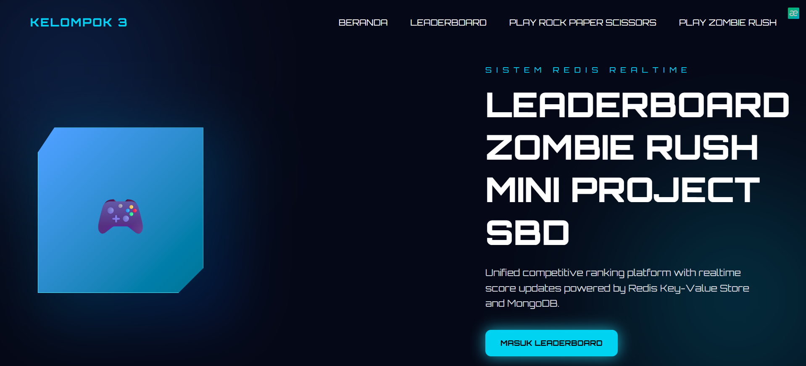

### Leaderboard Multi Game

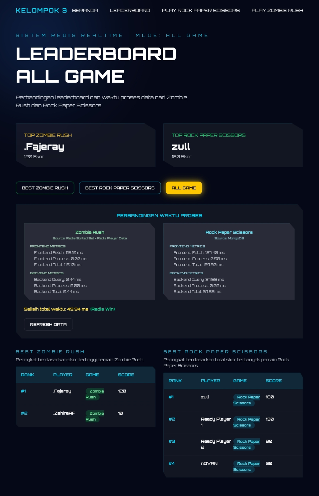

### Halaman Panduan Bermain ZombieRush

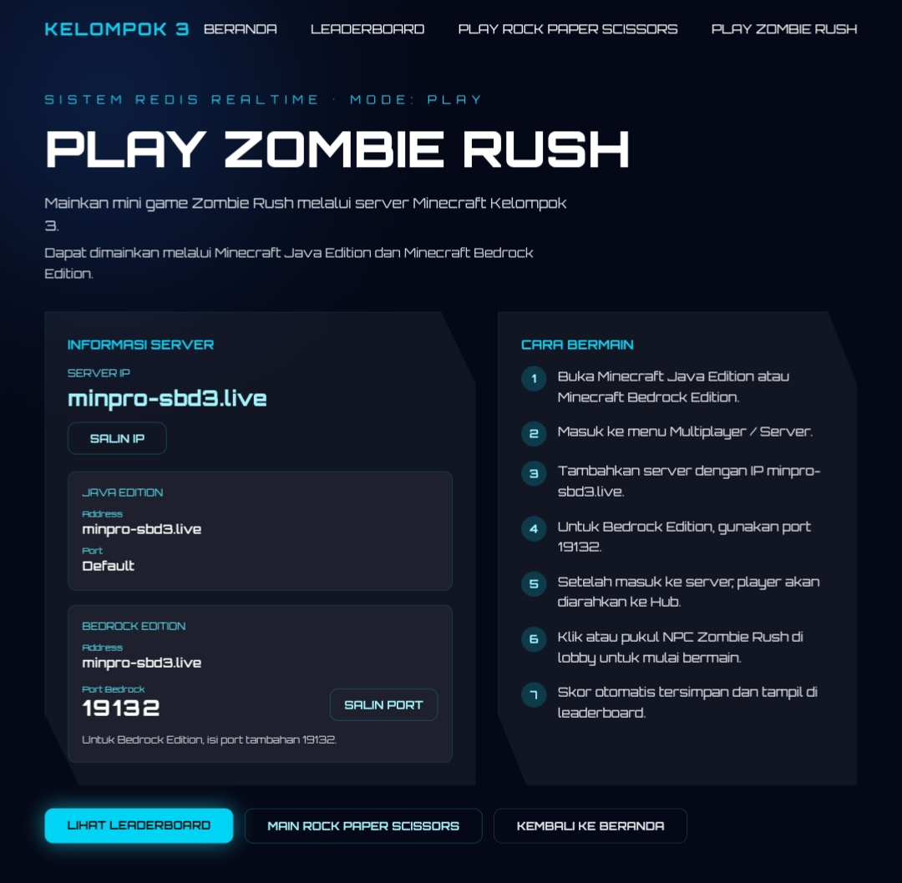

### Halaman Rock Paper Scissors
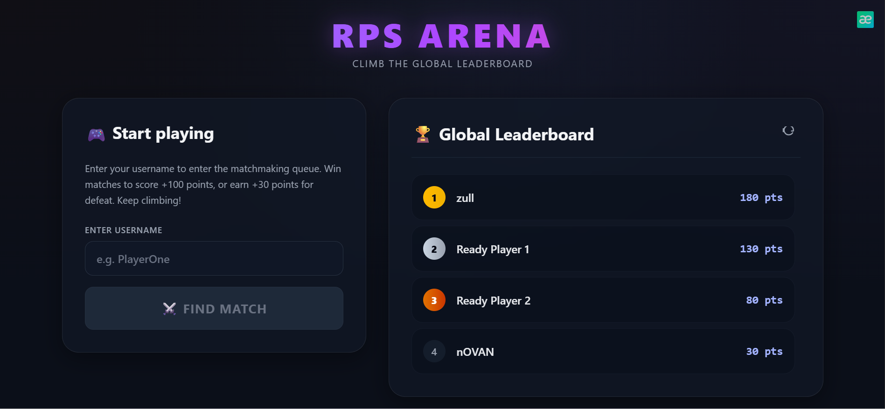

### Gameplay Rock Paper Scissors

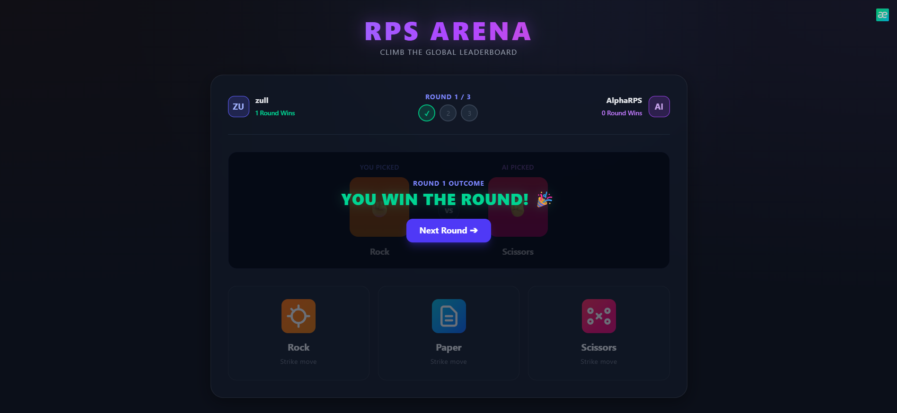

### Lobby Server Minecraft

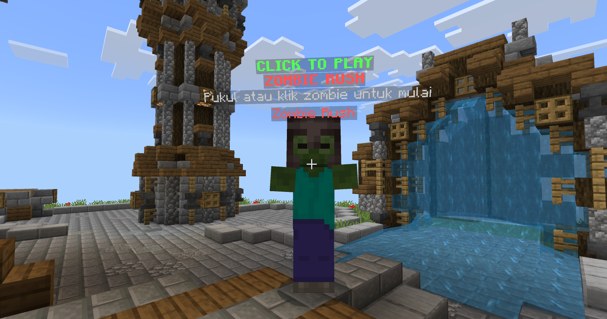

### Arena Match ZombieRush
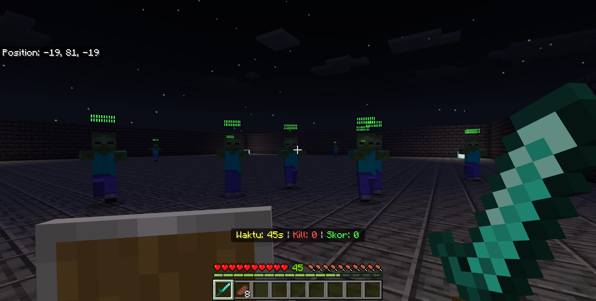

## Technology Stack

- Backend: Node.js, Express, SSE, Mongoose
- Frontend Dashboard: React, Vite, Tailwind CSS
- Frontend RPS: Next.js, React
- Game Server: Purpur/Paper 1.21.1, Java 21, Gradle
- Data: Redis, MongoDB

## System Architecture

Sistem terdiri dari plugin Minecraft ZombieRush yang menulis data ke Redis, backend API yang membaca Redis serta MongoDB, serta dua frontend web yang menampilkan leaderboard.

## Project Structure

```
PVP-LEADERBOARD/
├─ backend/
├─ frontend/
├─ othergame-frontend/
└─ plugin/
	 └─ ZombieRush/
```

## Database Design

### Redis - ZombieRush
- ZSET untuk leaderboard best score.
- HASH untuk data pemain (uuid, playerName, bestScore, totalScore, totalKills, totalMatches).

### MongoDB - Rock Paper Scissors
- Koleksi OthergameScore dengan field `username` (unik) dan `score`.

## API Reference

### ZombieRush
- POST `/api/zombierush/match-result`
- GET `/api/zombierush/leaderboard/best?limit=50`
- GET `/api/zombierush/player/:uuid`

### Rock Paper Scissors
- GET `/api/othergame/scores`
- POST `/api/othergame/scores`

### SSE Realtime
- GET `/api/scores/live`

## Environment Configuration

Gunakan placeholder berikut dan jangan menyimpan secret ke repository.

### backend/.env.example

```env
PORT=3000
MONGO_URI=mongodb://localhost:27017/pvp-leaderboard

REDIS_URL=redis://:password@127.0.0.1:6379/0
REDIS_HOST=127.0.0.1
REDIS_PORT=6379
REDIS_PASSWORD=
REDIS_DB=0
ZOMBIERUSH_REDIS_PREFIX=zombierush

ZOMBIERUSH_API_KEY=
```

### frontend/.env.example

```env
VITE_API_BASE_URL=http://localhost:3000
VITE_RPS_PLAY_URL=http://localhost:3001
```

### othergame-frontend/.env.example

```env
NEXT_PUBLIC_BACKEND_URL=http://localhost:3000
```

## Local Development Setup

1) Backend

```bash
cd backend
npm install
npm run dev
```

2) Frontend utama (Dashboard)

```bash
cd frontend
npm install
npm run dev
```

3) Frontend Rock Paper Scissors

```bash
cd othergame-frontend
npm install
npm run dev
```

4) Plugin ZombieRush

Ikuti panduan di `plugin/ZombieRush/README.md` untuk build dan instalasi plugin.

## Production Deployment Summary

- Nginx melayani static assets, reverse proxy API, dan subdomain RPS.
- PM2 menjalankan backend dan frontend RPS untuk uptime stabil.
- Redis dan MongoDB berjalan sebagai service internal.

## Security Notes

- Redis hanya terbuka pada localhost.
- Frontend tidak pernah terhubung langsung ke Redis.
- Backend idealnya diakses melalui Nginx pada path `/api`.
- Port 3000 dan 3001 dapat ditutup ke publik jika proxy Nginx sudah stabil.

## Diagram Sistem

### Flowchart Sistem

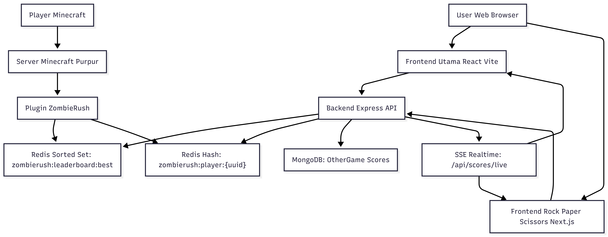

### Flowchart ZombieRush

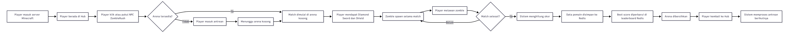

### Flowchart Rock Paper Scissors

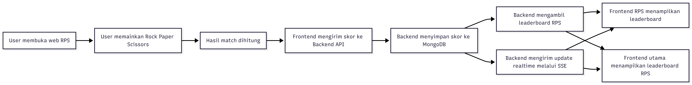

### UML / Component Diagram

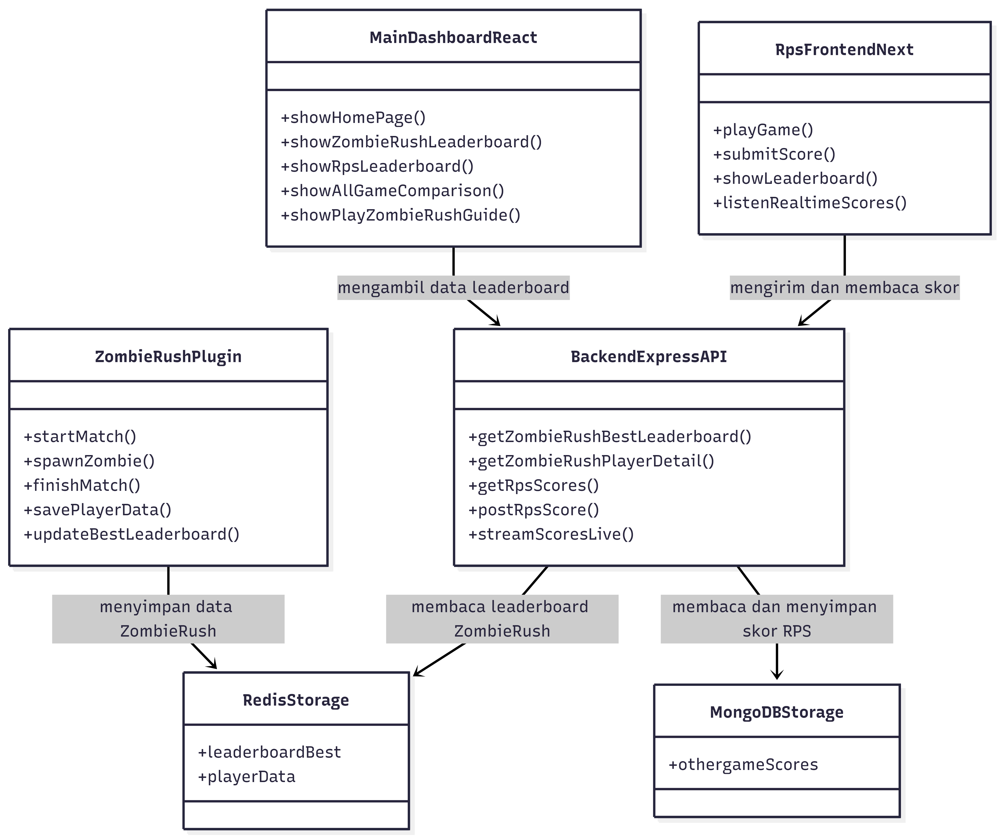

### ERD Konseptual

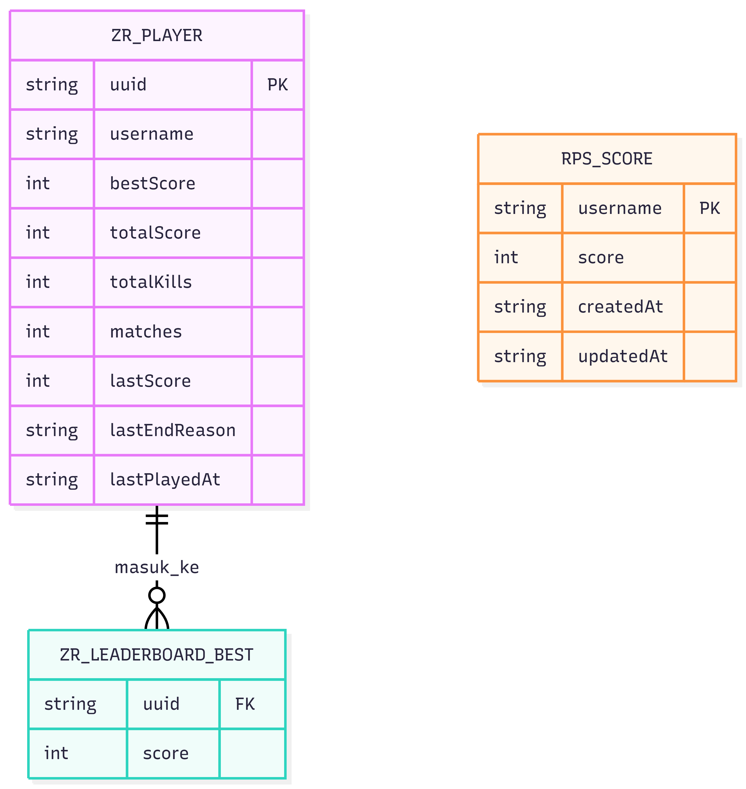

## Credits

Mini Project SBD Kelompok 3 - PVP Leaderboard

## AI Use
AI, secara spesifik, Gemini 3.1 dan 3.5 Flash dipakai untuk membantu pembuatan Frontend demi kemudahan hidup.