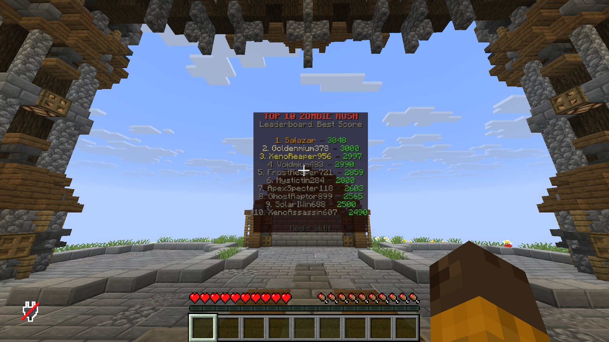
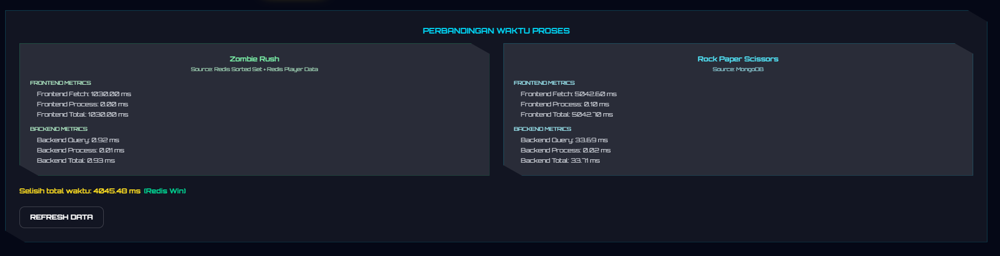
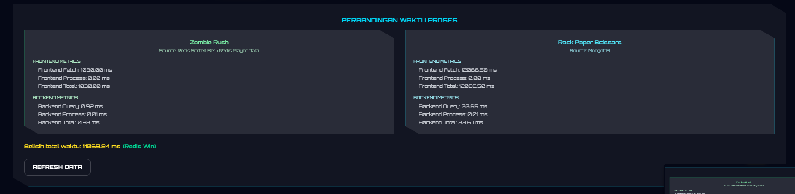
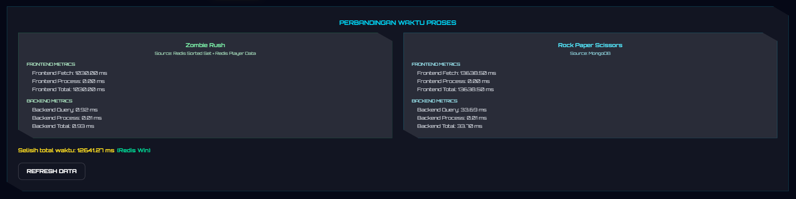
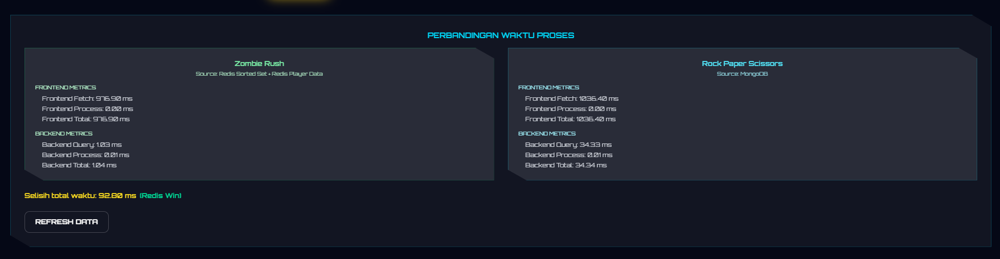
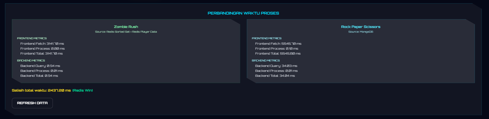
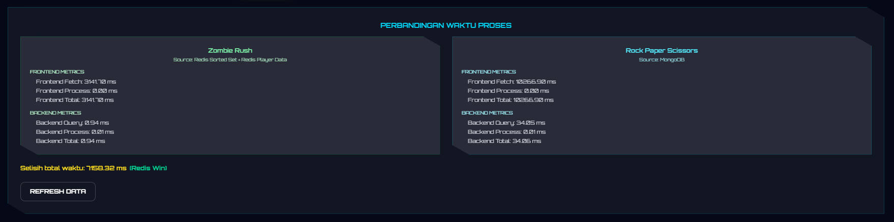

# PVP Leaderboard - Mini Project SBD Kelompok 3

Platform leaderboard multi-game yang mengintegrasikan backend API, dua frontend web, serta plugin Minecraft ZombieRush. Data ZombieRush disimpan di Redis melalui plugin dan dibaca oleh backend, sedangkan skor Rock Paper Scissors disimpan di MongoDB dan disajikan melalui API. Seluruh frontend mengonsumsi API dan SSE untuk pembaruan real-time.  

Access our Website : https://minpro-sbd3.live/

## Project Overview

- Backend Node.js/Express sebagai pusat API dan SSE.
- Frontend utama React/Vite sebagai dashboard leaderboard multi-game.
- Frontend Rock Paper Scissors berbasis Next.js.
- Plugin Minecraft ZombieRush (Purpur/Paper) sebagai penghasil data game.
- Redis untuk leaderboard ZombieRush dan MongoDB untuk skor RPS.
- Nginx untuk HTTPS, static frontend, dan reverse proxy API.
- PM2 untuk menjalankan backend dan frontend RPS di server.

## Meet Our Team

| Nama | NPM |
| --- | --- |
| Jesaya Hamonangan Gaudensius Malau | 2406409845 |
| Naziehan Labieb | 2406487102 |
| Salsabila Maharani Mumtaz | 2406348156 |
| Syifa Aulia Azhim | 2406413445 |
| Zulfahmi Fajri | 2406345425 |

## Main Features

### ZombieRush Minecraft Game
- Mode solo match berbasis arena dengan sistem skor otomatis.
- Pengiriman data skor ke Redis dan integrasi ke backend.
- Dukungan lobby, NPC pemicu match, dan leaderboard in-game.

### Rock Paper Scissors Web Game
- Game best-of-3 dengan pencatatan skor ke MongoDB.
- Leaderboard global yang diperbarui secara real-time melalui SSE.

### Main Dashboard
- Tab leaderboard multi-game dengan metrik frontend dan backend.
- Halaman panduan bermain Zombie Rush untuk pemain Minecraft.

### Backend API
- Endpoint untuk leaderboard ZombieRush, RPS, serta detail pemain.
- SSE untuk pembaruan real-time.

### Deployment
- Reverse proxy Nginx untuk HTTPS dan routing aplikasi.
- Manajemen proses dengan PM2.

## Tampilan Aplikasi

Bagian ini menampilkan dokumentasi visual dari sistem PVP Leaderboard yang sudah dibuat dan dideploy. Screenshot digunakan untuk memperlihatkan tampilan utama aplikasi, halaman leaderboard, halaman panduan bermain ZombieRush, game Rock Paper Scissors, serta integrasi dengan server Minecraft.

### Dashboard Utama

Halaman dashboard utama merupakan halaman awal dari website PVP Leaderboard. Pada halaman ini, user dapat melihat identitas project, navigasi utama, serta akses menuju halaman leaderboard, halaman Rock Paper Scissors, dan halaman panduan bermain ZombieRush. Tampilan ini menjadi pintu masuk utama sebelum user memilih fitur yang ingin digunakan.


### Leaderboard Multi Game

Halaman leaderboard multi-game digunakan untuk menampilkan data peringkat dari dua game yang berbeda, yaitu ZombieRush dan Rock Paper Scissors. Pada halaman ini terdapat tab untuk melihat leaderboard ZombieRush, leaderboard Rock Paper Scissors, dan tampilan gabungan melalui mode All Game. Data ZombieRush berasal dari Redis, sedangkan data Rock Paper Scissors berasal dari MongoDB.


Pada mode All Game, sistem juga menampilkan perbandingan waktu proses antara Redis dan MongoDB. Perbandingan ini mencakup frontend metrics dan backend metrics, sehingga user dapat melihat waktu pengambilan data, waktu proses data, total waktu, serta hasil perbandingan seperti `Redis Win` atau `MongoDB Win`.

### Halaman Panduan Bermain ZombieRush

Halaman ini berisi panduan bagi player yang ingin masuk ke server Minecraft dan memainkan ZombieRush. Informasi yang ditampilkan mencakup server address, port untuk Minecraft Bedrock Edition, serta langkah-langkah bermain mulai dari masuk server, menuju Hub, klik atau pukul NPC ZombieRush, hingga skor tersimpan dan muncul di leaderboard.


Halaman ini dibuat agar player tidak perlu mencari informasi server secara manual. Player cukup membuka halaman Play ZombieRush, menyalin IP server, lalu mengikuti instruksi yang tersedia.

### Halaman Rock Paper Scissors

Halaman Rock Paper Scissors merupakan frontend khusus untuk game RPS berbasis Next.js. Pada halaman ini, user dapat memasukkan username, memulai permainan, dan melihat leaderboard global Rock Paper Scissors. Data skor dari game ini dikirim ke backend dan disimpan ke MongoDB.


Leaderboard pada halaman RPS memperlihatkan daftar player berdasarkan skor tertinggi. Halaman ini juga menjadi bukti bahwa frontend RPS sudah terhubung dengan backend API dan dapat menampilkan data dari database.

### Gameplay Rock Paper Scissors

Screenshot ini menunjukkan tampilan saat permainan Rock Paper Scissors sedang berjalan. User dapat memilih Rock, Paper, atau Scissors, kemudian sistem akan menentukan hasil ronde berdasarkan pilihan user dan pilihan lawan. Setelah permainan selesai, skor user akan diperbarui dan dikirim ke backend.


Gameplay ini membuktikan bahwa halaman RPS tidak hanya menampilkan leaderboard, tetapi juga memiliki alur permainan yang berjalan dari input user, perhitungan hasil ronde, pembaruan skor, hingga penyimpanan data.

### Lobby Server Minecraft

Screenshot ini menunjukkan lobby atau Hub server Minecraft. Di area ini terdapat NPC ZombieRush yang dapat diklik atau dipukul oleh player untuk memulai match. Lobby juga berfungsi sebagai tempat awal player sebelum masuk ke arena ZombieRush.


Pada lobby, player diarahkan untuk berinteraksi dengan NPC ZombieRush. Setelah interaksi dilakukan, sistem akan mengecek ketersediaan arena. Jika arena tersedia, player langsung masuk ke match. Jika arena penuh, player akan masuk ke antrean.

### Arena Match ZombieRush

Screenshot ini menunjukkan kondisi saat player sedang berada di arena ZombieRush. Di dalam arena, zombie akan muncul selama match berlangsung. Player menggunakan item yang diberikan sistem, seperti Diamond Sword dan Shield, untuk mengalahkan zombie dan mengumpulkan skor.


Match ZombieRush berlangsung selama durasi tertentu. Sistem menghitung kill, skor, timer, serta kondisi akhir match seperti waktu habis, player mati, atau player keluar. Setelah match selesai, plugin akan menyimpan data hasil permainan ke Redis.

### Leaderboard ZombieRush

Screenshot ini menunjukkan leaderboard ZombieRush di dalam server Minecraft. Leaderboard ini menampilkan daftar player dengan skor terbaik. Data leaderboard berasal dari skor yang tersimpan setelah player menyelesaikan match ZombieRush.



Leaderboard ini menjadi bukti bahwa integrasi antara plugin ZombieRush dan sistem penyimpanan data sudah berjalan. Data yang berasal dari aktivitas player di Minecraft dapat disimpan, diurutkan, dan ditampilkan kembali sebagai peringkat pemain.

## Redis vs MongoDB

Bagian ini menampilkan hasil pengujian perbandingan waktu proses antara Redis dan MongoDB pada sistem PVP Leaderboard. Pada project ini, Redis digunakan untuk menyimpan leaderboard ZombieRush, sedangkan MongoDB digunakan untuk menyimpan skor Rock Paper Scissors.

Redis digunakan pada ZombieRush karena data leaderboard membutuhkan proses pengurutan skor yang cepat. Struktur data utama yang digunakan adalah Redis Sorted Set atau ZSET, yaitu struktur data yang menyimpan member unik dengan score tertentu. Struktur ini cocok untuk leaderboard karena data dapat diurutkan berdasarkan score tertinggi. Dalam project ini, UUID player menjadi member, sedangkan best score player menjadi score. Redis juga menyimpan detail pemain menggunakan Hash, seperti username, bestScore, totalScore, totalKills, matches, lastScore, lastEndReason, dan lastPlayedAt. Redis sendiri memang menyediakan Sorted Set untuk use case seperti leaderboard.  

MongoDB digunakan pada Rock Paper Scissors karena data skor game web disimpan dalam bentuk dokumen. MongoDB menyimpan data sebagai document di dalam collection, sehingga cocok untuk menyimpan data seperti username dan score pemain RPS. Pada project ini, collection RPS menyimpan data player dan skor yang kemudian dibaca oleh backend untuk ditampilkan pada leaderboard. MongoDB menyimpan data record sebagai BSON document di dalam collection.  

### Tujuan Perbandingan

Tujuan dari pengujian ini adalah untuk melihat perbedaan waktu proses antara dua sumber data yang digunakan dalam project:

| Game | Database | Struktur Data | Fungsi |
| --- | --- | --- | --- |
| ZombieRush | Redis | Sorted Set dan Hash | Menyimpan leaderboard best score dan detail player |
| Rock Paper Scissors | MongoDB | Collection dan Document | Menyimpan skor player RPS |

### Metrik yang Dibandingkan

Pada dashboard, sistem menampilkan beberapa metrik waktu proses:

| Metrik | Penjelasan |
| --- | --- |
| Frontend Fetch | Waktu yang dibutuhkan browser untuk mengambil data dari backend API |
| Frontend Process | Waktu yang dibutuhkan frontend untuk memproses data sebelum ditampilkan |
| Frontend Total | Total waktu frontend, yaitu fetch ditambah process |
| Backend Query | Waktu yang dibutuhkan backend untuk mengambil data dari Redis atau MongoDB |
| Backend Process | Waktu yang dibutuhkan backend untuk mengolah data setelah query database |
| Backend Total | Total waktu backend, yaitu query ditambah process |
| Selisih Total Waktu | Perbedaan total waktu antara ZombieRush dan Rock Paper Scissors |
| Redis Win / MongoDB Win | Penanda database yang memiliki total waktu lebih kecil pada pengujian tersebut |

Pengukuran waktu frontend dilakukan dari sisi browser saat mengambil dan memproses data. Pengukuran seperti ini umumnya menggunakan timestamp resolusi tinggi dalam satuan milidetik, misalnya melalui `performance.now()` pada browser.

### Rumus Perhitungan

Total waktu end-to-end dihitung dari gabungan waktu frontend dan backend:

```text
ZombieRush Total = Frontend Total ZombieRush + Backend Total ZombieRush

RPS Total = Frontend Total RPS + Backend Total RPS

Selisih Total = |ZombieRush Total - RPS Total|
```

### Hasil Pengujian

Berdasarkan hasil pengujian pada dashboard, Redis lebih cepat pada skenario leaderboard ZombieRush. Hal ini terlihat dari beberapa kali pengujian yang menunjukkan nilai total waktu ZombieRush lebih kecil dibandingkan total waktu Rock Paper Scissors.

Pada sisi backend, Redis memiliki waktu query yang rendah karena leaderboard ZombieRush menggunakan Sorted Set. Backend mengambil ranking dari Redis Sorted Set, lalu mengambil detail player dari Redis Hash. Sementara itu, MongoDB mengambil data skor RPS dari collection, kemudian backend mengolah data tersebut sebelum dikirim ke frontend.

Pada sisi frontend, waktu dapat berubah-ubah karena dipengaruhi oleh proses fetch, kondisi jaringan, ukuran response, cache browser, dan proses rendering data. Karena itu, hasil pengujian ditampilkan dalam beberapa screenshot agar terlihat bahwa perbandingan dilakukan lebih dari satu kali.

### Bukti Pengujian

Berikut adalah beberapa screenshot hasil pengujian Redis vs MongoDB pada dashboard:









### Kesimpulan Perbandingan

Dari hasil pengujian, Redis lebih cepat pada skenario leaderboard ZombieRush karena menggunakan Sorted Set untuk pengurutan skor dan Hash untuk detail player. MongoDB tetap digunakan pada Rock Paper Scissors karena lebih cocok untuk penyimpanan data berbentuk dokumen seperti username dan score.

## Testing dan Validasi Sistem

Pengujian dilakukan untuk memastikan seluruh komponen pada sistem PVP Leaderboard berjalan sesuai dengan tujuan project, mulai dari game Minecraft Zombie Rush, game web Rock Paper Scissors, backend API, Redis, MongoDB, SSE realtime, hingga tampilan dashboard frontend.

Pengujian ini tidak hanya berfokus pada tampilan website, tetapi juga memastikan bahwa alur data dari game menuju database, dari database menuju backend, dan dari backend menuju frontend sudah berjalan dengan benar.

### Tujuan Pengujian Sistem

Tujuan dari pengujian sistem ini adalah:

1. Memastikan plugin ZombieRush dapat mengirim dan menyimpan data skor pemain ke Redis.
2. Memastikan Redis menyimpan leaderboard ZombieRush menggunakan struktur data yang sesuai.
3. Memastikan backend dapat membaca data ZombieRush dari Redis.
4. Memastikan game Rock Paper Scissors dapat menyimpan dan membaca skor dari MongoDB.
5. Memastikan backend dapat menyediakan endpoint API untuk frontend utama dan frontend RPS.
6. Memastikan frontend utama dapat menampilkan leaderboard ZombieRush dan Rock Paper Scissors.
7. Memastikan fitur SSE realtime dapat digunakan untuk pembaruan data skor.
8. Memastikan website production dapat diakses melalui domain yang sudah dideploy.
9. Memastikan perbandingan waktu proses Redis dan MongoDB dapat ditampilkan pada dashboard.

### Lingkup Pengujian Sistem

Pengujian mencakup beberapa bagian utama:

| Bagian yang Diuji | Tujuan Pengujian | Hasil yang Diharapkan |
| --- | --- | --- |
| Website utama | Memastikan frontend utama dapat diakses melalui domain production | Website `https://minpro-sbd3.live` dapat dibuka |
| Halaman leaderboard | Memastikan leaderboard multi-game tampil dengan benar | Data ZombieRush dan RPS muncul pada tabel leaderboard |
| Halaman panduan ZombieRush | Memastikan informasi server Minecraft tersedia | IP server, port Java, port Bedrock, dan cara bermain tampil |
| Frontend RPS | Memastikan game RPS dapat diakses dan dimainkan | Halaman RPS terbuka dan pemain dapat menjalankan permainan |
| Gameplay RPS | Memastikan hasil permainan dapat menghasilkan skor | Skor pemain bertambah setelah permainan selesai |
| Server Minecraft | Memastikan player dapat masuk ke server | Player berhasil masuk ke lobby atau Hub |
| NPC ZombieRush | Memastikan player dapat memulai match | Player dapat klik atau pukul NPC untuk masuk ke arena |
| Arena ZombieRush | Memastikan match berjalan | Zombie muncul, timer berjalan, dan skor dapat dihitung |
| Redis ZombieRush | Memastikan data skor tersimpan di Redis | Data masuk ke `zombierush:leaderboard:best` dan `zombierush:player:{uuid}` |
| MongoDB RPS | Memastikan skor RPS tersimpan di MongoDB | Data skor RPS tersimpan dan dapat dibaca kembali |
| Backend API | Memastikan endpoint mengembalikan response JSON | Endpoint API mengembalikan data leaderboard |
| SSE realtime | Memastikan frontend dapat menerima sinyal update | Frontend dapat melakukan refresh data saat ada update |
| Metrics Redis vs MongoDB | Memastikan waktu proses dapat dibandingkan | Frontend metrics, backend metrics, dan pemenang tampil |

## Technology Stack

- Backend: Node.js, Express, SSE, Mongoose
- Frontend Dashboard: React, Vite, Tailwind CSS
- Frontend RPS: Next.js, React
- Game Server: Purpur/Paper 1.21.1, Java 21, Gradle
- Data: Redis, MongoDB

## System Architecture

Sistem terdiri dari plugin Minecraft ZombieRush yang menulis data ke Redis, backend API yang membaca Redis serta MongoDB, serta dua frontend web yang menampilkan leaderboard.

## Project Structure

```
PVP-LEADERBOARD/
├─ backend/
├─ frontend/
├─ othergame-frontend/
└─ plugin/
	 └─ ZombieRush/
```

## Database Design

### Redis - ZombieRush
- ZSET untuk leaderboard best score.
- HASH untuk data pemain (uuid, playerName, bestScore, totalScore, totalKills, totalMatches).

### MongoDB - Rock Paper Scissors
- Koleksi OthergameScore dengan field `username` (unik) dan `score`.

## API Reference

### ZombieRush
- POST `/api/zombierush/match-result`
- GET `/api/zombierush/leaderboard/best?limit=50`
- GET `/api/zombierush/player/:uuid`

### Rock Paper Scissors
- GET `/api/othergame/scores`
- POST `/api/othergame/scores`

### SSE Realtime
- GET `/api/scores/live`

## Environment Configuration

Gunakan placeholder berikut dan jangan menyimpan secret ke repository.

### backend/.env.example

```env
PORT=3000
MONGO_URI=mongodb://localhost:27017/pvp-leaderboard

REDIS_URL=redis://:password@127.0.0.1:6379/0
REDIS_HOST=127.0.0.1
REDIS_PORT=6379
REDIS_PASSWORD=
REDIS_DB=0
ZOMBIERUSH_REDIS_PREFIX=zombierush

ZOMBIERUSH_API_KEY=
```

### frontend/.env.example

```env
VITE_API_BASE_URL=http://localhost:3000
VITE_RPS_PLAY_URL=http://localhost:3001
```

### othergame-frontend/.env.example

```env
NEXT_PUBLIC_BACKEND_URL=http://localhost:3000
```

## Local Development Setup

1) Backend

```bash
cd backend
npm install
npm run dev
```

2) Frontend utama (Dashboard)

```bash
cd frontend
npm install
npm run dev
```

3) Frontend Rock Paper Scissors

```bash
cd othergame-frontend
npm install
npm run dev
```

4) Plugin ZombieRush

Ikuti panduan di `plugin/ZombieRush/README.md` untuk build dan instalasi plugin.

5) Dummy Data Test

```bash
node run-parallel.js
```

## Production Deployment Summary

- Nginx melayani static assets, reverse proxy API, dan subdomain RPS.
- PM2 menjalankan backend dan frontend RPS untuk uptime stabil.
- Redis dan MongoDB berjalan sebagai service internal.

## Security Notes

- Redis hanya terbuka pada localhost.
- Frontend tidak pernah terhubung langsung ke Redis.
- Backend idealnya diakses melalui Nginx pada path `/api`.
- Port 3000 dan 3001 dapat ditutup ke publik jika proxy Nginx sudah stabil.

## Diagram Sistem

### Flowchart Sistem


### Flowchart ZombieRush


### Flowchart Rock Paper Scissors


### UML / Component Diagram


### ERD Konseptual


## Credits

Mini Project SBD Kelompok 3 - PVP Leaderboard

## AI Use
AI, secara spesifik, Gemini 3.1 dan 3.5 Flash dipakai untuk membantu pembuatan Frontend demi kemudahan hidup.
